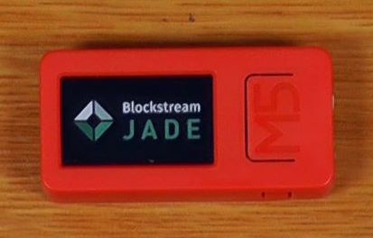
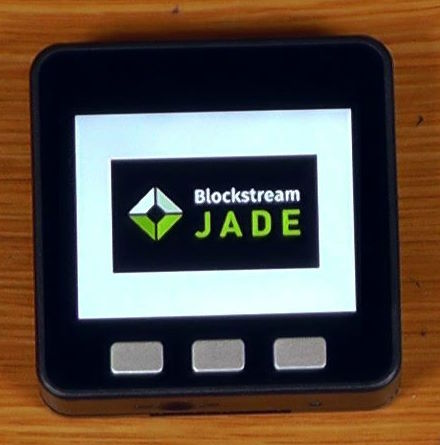

# WARNING
DO NOT ATTEMPT TO FLASH DIY FIRMWARE TO OFFICIAL BLOCKSTREAM JADE HW UNITS

DO NOT ATTEMPT TO FLASH OFFICIAL BLOCKSTREAM FIRMWARE TO YOUR DIY HARDWARE

# Hardware Selection
There are a number of hardware devices that can run Jade firmware with minimal configuration by simply following the build guide in the main readme.

## No-Camera Hardware Options:
###TTGO (Lillygo) T-Display

* ~$10 USD
* Two button interface (Press both together to select)
* No battery
* No case
* Typically supports Secure Boot V2
###M5 StickC-Plus

* ~$20 USD
* Two button interface (Long press front button to select)
* Includes 120mAh battery
* Fully assembled with case
* Typically supports Secure Boot V1
###M5 Stack Basic

* ~$40 USD
* Three button interface (Middle button to select)
* Includes 110mAh battery
* Fully assembled with case
* Typically supports Secure Boot V2
###M5 Stack Fire (~$50 USD)
* ~$40 USD
* Extra 8mb PSRAM (When compared to Basic)
* Three button interface (Middle button to select)
* Includes 500mAh battery
* Fully assembled with case
* Typically supports Secure Boot V2

# Modifying Configuration Files for Use
Once you are familiar with the process of flashing the firmware using the sdkconfig templates that are included with this repository, there are some additional changes that you should make to these files before using them with actual funds. You can find example of suggested configuration files for both "nodebug" and "secureboot" the "diy" folder of this repository.

## Disabling Debug Features
If editing the default development configuration template...

You can find suggested configuration templates for various hardware in the "diy" folder of this repository.

**Add**

`CONFIG_LOG_DEFAULT_LEVEL_NONE=y` 

**Remove** 

`CONFIG_DEBUG_MODE=y` 

## Enabling Secure Boot  
If you want to maximise the physical security of your device and prevent it from running firmware that you haven't signed with your signing key, you can enable Secure Boot.

You can find suggested configuration templates for various hardware in the "diy" folder of this repository. These are designed to mimic the settings found on a retail Jade device.

_Warning: Doing this cannot be un-done, nor can the signing key that the device will accept be changed._

[Read the official vendor documentation](https://docs.espressif.com/projects/esp-idf/en/latest/esp32/security/secure-boot-v2.html)

**Add**

    CONFIG_ESP32_DISABLE_BASIC_ROM_CONSOLE=y 
    CONFIG_SECURE_DISABLE_ROM_DL_MODE=y 
    CONFIG_SECURE_BOOT_SIGNING_KEY=<PATH_TO_YOUR_SIGNING_KEY>
    CONFIG_SECURE_BOOT=y
    CONFIG_SECURE_FLASH_ENC_ENABLED=y
    CONFIG_SECURE_FLASH_ENCRYPTION_MODE_RELEASE=y
    CONFIG_ESP32_REV_MIN_3=y

_Depending on the hardare you have selected, you may need to remove the last line that requires a minimum of Rev3 hardware..._

**Remove**

`CONFIG_EFUSE_VIRTUAL=y`

# Upgrading firmware via OTA
If you have enabled secure boot with the settings suggested above you will need to do firmware updates via OTA.

An example command to do this using the jade.bin file in the /build folder would be:

`python jade_ota.py --noagent`